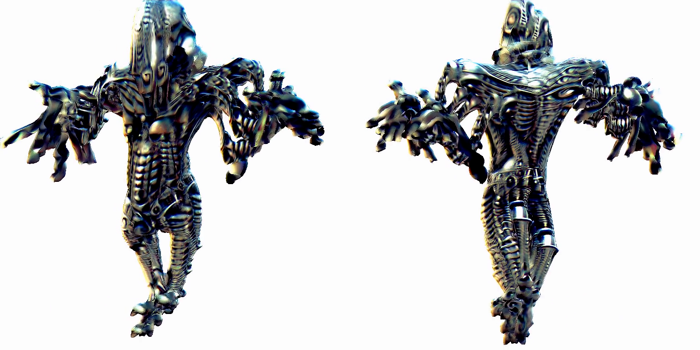

Figure: example ClipMatrix 3d mesh output for text prompt "Mecha Warrior in Sci Fi Giger style"

# open_clipmatrix : very short intro
An open source ClipMatrix AI tool for text_to_3d mesh mapping; fixed deformable mesh template without rigging.
Have fun making funny 3d creatures with it.
Use provided jupyter notebook to define text prompts and use the tool.

I suggest to run in Colab, import and installs defined for this case. With small modifications you could also get it to run locally.
In any case, use at least a 16GB GPU card for smooth performance.

# Introduction to ClipMatrix: text controlled 3D mesh deformation and stylization.

A novel type of text controlled AI generative art: you give a text and get a 3D textured shape from it. 
This code is loosely based on my recent [paper](https://arxiv.org/abs/2109.12922), but has many more tricks inside. Feel free to play with it, make art or even better: experiment with new ML techniques based on it.
Please cite my twitter account [@NJetchev](https://twitter.com/NJetchev) or the paper when using this code, posting artwork from it or modifying it.

Inputs from you:
- starting mesh template
- text prompt to be interpreted by CLIP

Outputs: videos of the resulting generated mesh. by default saved in **clip_videos** folder

Cool features:
- check my account for artwork and inspiration what is possible [@NJetchev](https://twitter.com/NJetchev) 
- support for arbitrary template meshes for starting shapes
- enhance starting templates by cloning
- define regions of interest for fine part control
- shadow mapping
- normal mapping
- [Sobolev smoothing](https://github.com/rgl-epfl/large-steps-pytorch) 
- neural shaders for advanced animation effects
- you can export the 3D mesh file and print your work in a 3D printer service

Libraries and references used: quite many, but I am most thankful to 
- OpenAI's CLIP 
- Meta's Pytorch3D
- the authors of this [paper](https://rgl.epfl.ch/publications/Nicolet2021Large)
- the researchers of [SMPL](https://smpl.is.tue.mpg.de/) , the sample static model.obj is taken from their website for research purposes
- [@nonlethalcode](https://twitter.com/nonlethalcode) for helpful suggestions and testing of the UI of this code

What is my plan for next updates of Open_ClipMatrix:
- this code is related to the recent [ClipMatrix Creatures](https://clipmatrix.wordpress.com/) art project. If you appreciate it, holders of NFT Creatures will get earlier exclusive access to new versions of the ClipMatrix tool
-  currently there are no riggable models inside, just static templates. I may add them in the future, not certain yet. It can complicate the code and increase runtimes a lot. 
- In this version I focused on a small and agile demo that is fun and fast to play with.

**CHANGELOG:**
- 0.65 initial version

- 0.651 few bug fixed, options to disable shaders and normal maps

- 0.7 added graph convolutions, fixed library paths; default regularization strength settings favor stronger mesh deformation

- 0.8 better shadows, fixed library paths, support multiple template clones
